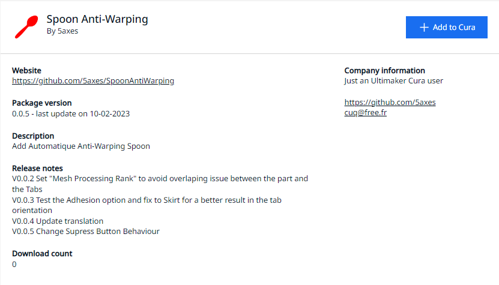

# Spoon Anti-Warping

Plugin Cura Spoon Anti-Warping.

The Spoon Anti-warping plugin is a tool designed to prevent warping of sharp edges in Cura. Warping is a common issue that occurs when a 3D printed object is cooled too quickly, causing the edges to curl or bend. The Spoon Anti-warping plugin addresses this problem by adding tabs to the design of the object.

Tabs are small, flat extensions that are added to the edges of the object. These tabs act as anchors, holding the edges in place as the object cools and preventing them from warping. The size and number of tabs can be adjusted to suit the specific needs of the object being printed.

I have already an [Tab anti-warping plugin](https://github.com/5axes/TabPlus) but it's not really compatible with the creation of support. With this plugin we can create anti-warping tab as well as support for the print.

## Installation

First, make sure your Cura version is 4.8 or newer.

[Download](https://github.com/5axes/SpoonAntiWarping/archive/refs/heads/main.zip) or clone the repository into `[Cura configuration folder]/plugins/SpoonAntiWarping`.

The configuration folder can be found via **Help** -> **Show Configuration Folder** inside Cura.

This menu opens the following folder:
* Windows: `%APPDATA%\cura\<Cura version>\`, (usually `C:\Users\<your username>\AppData\Roaming\cura\<Cura version>\`)
* Mac OS: `$HOME/Library/Application Support/cura/<Cura version>/`
* Linux: `$HOME/.local/share/cura/<Cura version>/`

### Automatic installation for Cura 4.X and Cura 5.X

First, make sure your Cura version is 4.8 or newer. This plugin is now avalaible in the Cura marketplace. So you can install it automaticaly from this place:

[Spoon Anti-Warping on Ultimaker Market place](https://marketplace.ultimaker.com/app/cura/plugins/5axes/SpoonAntiWarping)

## How to use it

The Spoon Anti-warping plugin offers two methods for adding tabs to a 3D printed object: manual and automatic.

The manual method allows users to manually select the position of the tabs on the object. This method is useful for adding tabs to specific areas that are prone to warping, such as sharp edges or thin sections. To use the manual method, the user simply clicks the position where they want to add the tabs to create them. This allows for precise control over the number and placement of tabs, which can be important in some cases.

### Manual Creation

- Load a model in Cura and select it
- Click on the "Spoon Anti-Warping" button on the left toolbar  (Shortcut K)
- Change de value for the tab *Diameter* , the *Spoon Handle Length* or the *Spoon Handle Width* in numeric input fields in the tool panel if necessary

- Click anywhere on the model to place "Spoon Anti-Warping" there

- **Clicking existing Tab deletes it**

- **Clicking existing Tab + Ctrl** switch automaticaly to the ***Rotate Tool*** to modify the orientation of the "Spoon Anti-Warping" tab.

* The height of the tabs is automaticaly set to the Initial Layer Height + layer height according to the number of layer define in the plugin options.

>Note: it's easier to add/remove tabs when you are in "Solid View" mode

### Automatic Creation

The automatic method, on the other hand, uses an algorithm to automatically generate tabs in the convex_hull border of the part. This method is useful for those who want to quickly add tabs to an entire object without having to manually select each location. 

### Notes

In order for the Spoon Anti-warping plugin to work correctly in the Cura slicing software, the adherence option must be enabled. This option creates internaly in Cura an adherence border.

Even if the user does not want to use the raft for the final print, it is necessary to have it enabled while using the Spoon Anti-warping plugin. The plugin uses the these border to calculate the tab orientation. Once the tabs creation is complete, you can remove this option if you don't want anay adherence option creation in the final print.

## Modifications

### V1.1.0

New Option **Direct Shape**.

## YouTube video

### V1.0.1

### V1.1.0

New Option to get a new tab shape.

